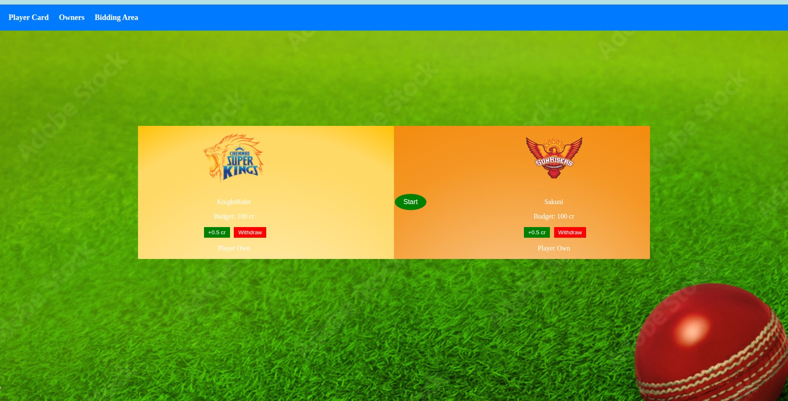
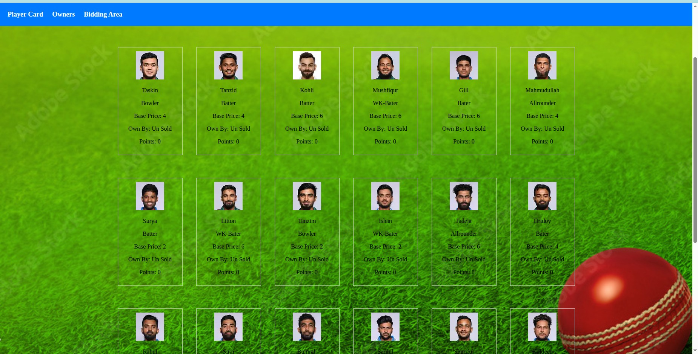

# BidGame

**BidGame** is a multiplayer fantasy bidding game where users strategically bid for players, adding a unique twist to traditional player selection.

## Current Version

The current version includes:
- A hard-coded player list.
- A link to match websites for player performance.
- Local-only play (both players log in on the same system).

---

## Screenshots

### Game Start Screen

*Players choose their in-game names — shown here: `KnightRider` and `Sakuni`.*

### Bidding Screen

*Live bidding interface where players bid for a fantasy player.*

### Available Player List

*Shows the list of available players to help bidders plan their strategy.*

